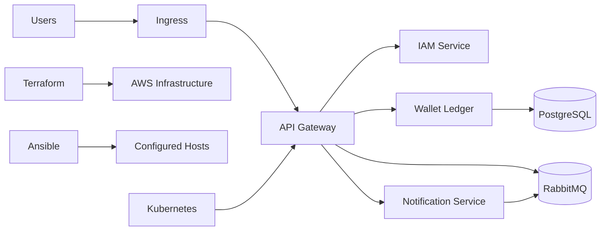

 # DevOps Platform

Infrastructure and deployment definitions for a containerized platform composed of an API gateway, IAM, wallet ledger, and notification services.

## Repository layout

- `terraform/`: AWS infrastructure modules and environment-specific stacks.
- `ansible/`: host configuration roles and inventory.
- `docker/`: local service image definitions and Compose development setup.
- `k8s/`: Kubernetes workloads, networking, RBAC, and Helm values.
- `.github/workflows/`: CI/CD and infrastructure security checks.
- `monitoring/`: Prometheus and Grafana configuration.
- `docs/`: architecture and operations documentation.

## Architecture

## How to run

1. Copy environment-specific Terraform variables into the appropriate `terraform/environments/<environment>/` directory.
2. Run `terraform init` and `terraform plan` from that environment directory.
3. Configure `ansible/inventory/hosts.ini`, then run `ansible-playbook -i ansible/inventory/hosts.ini ansible/playbook.yml`.
4. Start local dependencies with `docker compose -f docker/docker-compose.yml up --build`.
5. Apply Kubernetes resources with `kubectl apply -f k8s/` after configuring cluster access.

Never commit credentials, private keys, or plaintext Kubernetes secrets.
